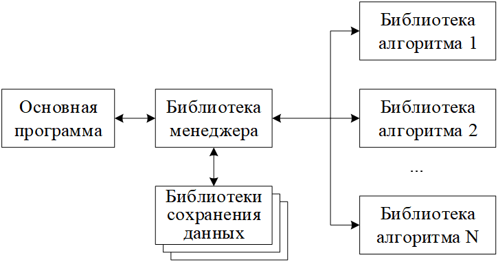
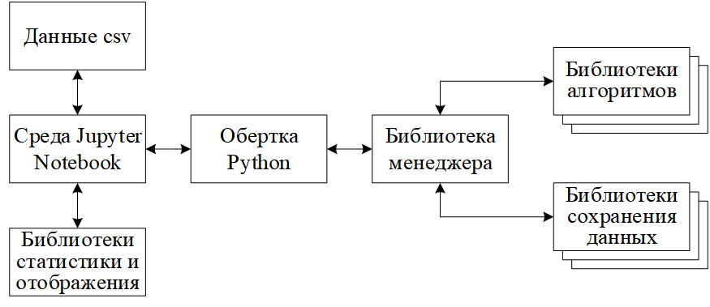
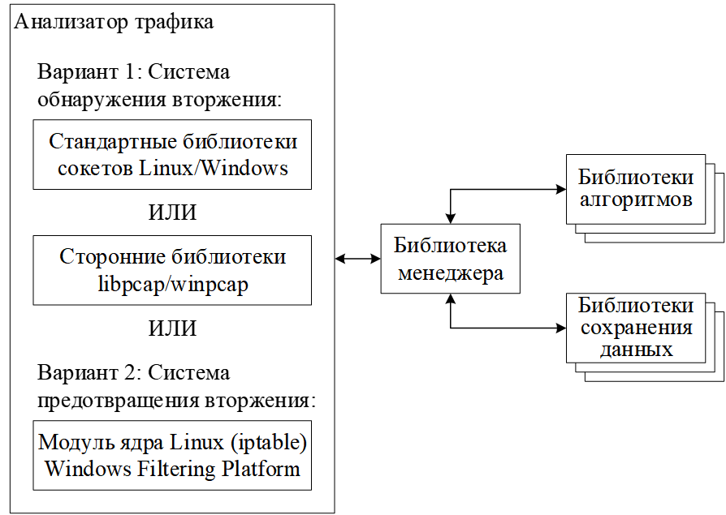
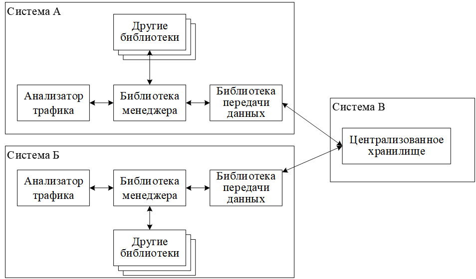

# libIAM (Immune Algorithm Manager library) 
**libIAM** – библиотека для управления различными модификациями иммунных алгоритмов, поставляемых в виде динамических библиотек.  
Преимущественно рассматриваются алгоритмы отрицательного отбора (АОО, NSA, Negative Selection Algorithm) с вещественным и бинарным кодированием с целью обнаружения вторжений в трафике сети и построения сетевой системы обнаружения вторжения (ССОВ, NIDS, Network Intrusion Detection Systems).

Данная библиотека должна убрать ограничения прошлой реализации [NSA-based_NIDS](https://github.com/Ansek/NSA-based_NIDS) за счёт модульности.

Цель отделить алгоритмы от дополнительной логики по хранению параметров и результатов их работы (баз детекторов). Т.е. задача сводится к указанию нужных параметров и регистрации функций с уникальной логикой.
А внешней части программы достаточно передать данные менеджеру, который распределит их между модулями согласно заданным настройкам.  


Единый интерфейс позволяет протестировать одну и ту же реализацию алгоритма различными способами. Например, сначала получить теоретические оценки эффективности модели за счёт обучения на общедоступных наборах данных (например подготовленных в csv или исходных pcap/tcpdump):  


А затем встроить в конкретную реализацию:  


При этом можно можно независимо от внешнего модуля и библиотек изменить локальное хранилище на централизованное (например, для сбора и распространения детекторов в различные сети):  


Также планировать протестировать работу на микроконтроллерах (ESP8266, STM32F411).

На текущий момент реализован тестовый вариант с Python-библиотекой (с жесткой привязкой в коде) для вызова вещественного алгоритма и два модуля сохранения данных:
* [python_c_api](examples/python_c_api/) - обертка libIAM через Python C API;
* [NSA_RV](plugins/real_encoding/NSA_RV/) - вещественных АОО на основе детекторов с постоянным и переменным радиусом;
* [setting_json](plugins/storage/setting_json/) - хранение параметров алгоритмов в файле setting.json;
* [log_txt](plugins/storage/log_txt/) - логирование в файл log.txt.

Пример использования:
```Python
import sys
import numpy as np
sys.path.insert(1, 'D:/SUAI/IAM/lib/')
import iam

iam.init_lib()
x = np.random.rand(10000, 46)
y = np.random.randint(0, 2, 10000, dtype='uint8')
iam.fit('NSA_RV', x, y, 'Vdetectors', 0)
print(iam.predict('NSA_RV', x, '', 0).shape)
iam.exit_lib()
```

Требуется основательная доработка Python-обертки и самих алгоритмов. Тестирование с данными CIC IOT Dataset2023 не дало особых результатов. Это связано с тем, что больше времени было выделено на разработку основы библиотеки и мало на ознакомление с обучающими данными.

Сборка проекта осуществляется с помощью cmake. Для упрощения в директории scripts определены командные файлы init, build_and_test и install для ОС Windows и Linux. При этом подгружаются библиотеки: [Jansson](https://github.com/akheron/jansson), [Unity Test](https://github.com/ThrowTheSwitch/Unity) и [Fake Function Framework](https://github.com/meekrosoft/fff).
